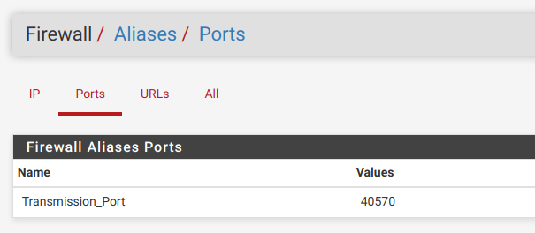
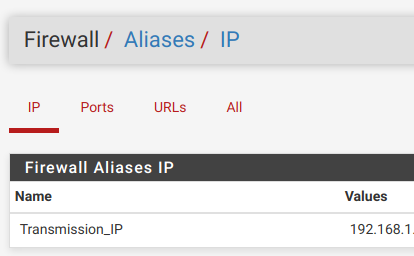
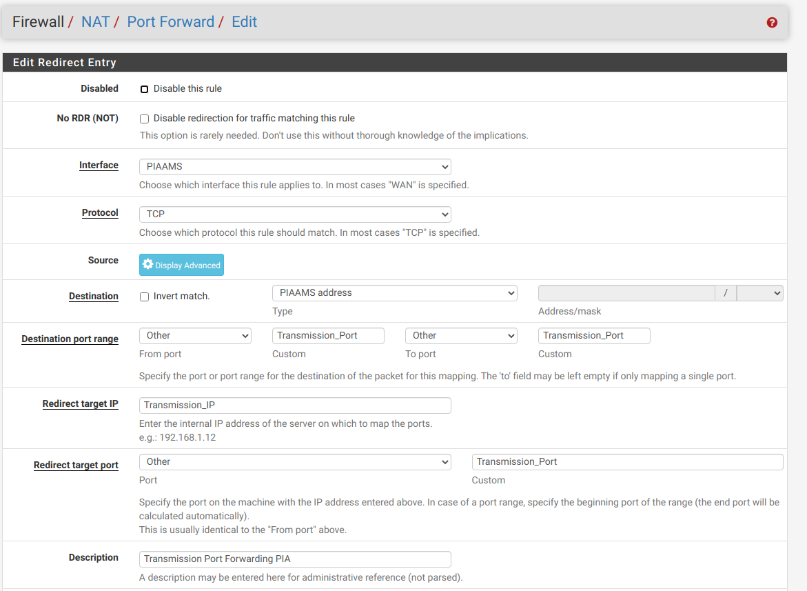
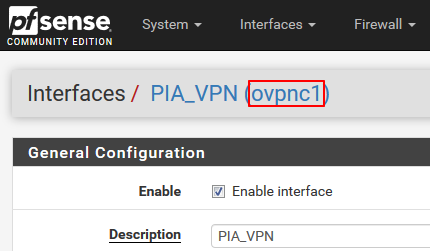
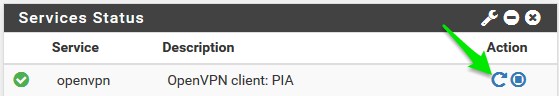
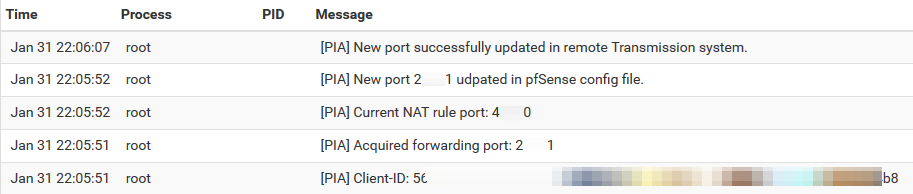
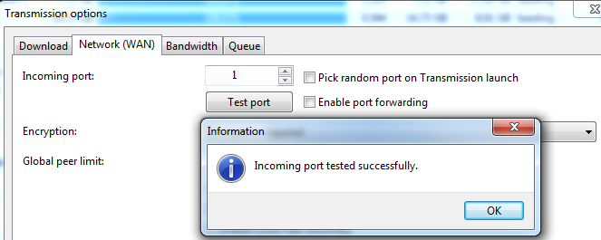

# PIA NextGen Servers Port Forwarding + qBittorrent support - Unofficial
New PIA pfSense (Private Internet Access) port forwarding API script for next gen servers. Tested on pfSense 2.6.0-RELEASE (amd64) and qBittorrent 4.2.5 on Debian. 

## This guide is based on fm407's original guide for Transmission, and adapted for use with qBittorrent. See https://github.com/fm407/PIA-NextGen-PortForwarding

## **Before starting make sure to have configured PIA on your pfSense according to this guide: https://blog.networkprofile.org/private-internet-access-vpn-on-pfsense/**

For a list of nextgen servers supporting port forwarding: https://github.com/8ctorres/PIA-NextGen-PortForwarding/blob/master/nextgen-portforward-servers.txt 

The scripts have variables that you must change in order for the script to work, make sure to read the scripts before running them.

Your pfSense needs the following packages: `xmlstarlet` `jq` (details in step I.8.)

Now you can follow this guide:

# **I. pfSense side**

**1.Make sure you have SSH root access to your pfSense machine**</br>
You can login as the "admin" user directly, or use a different user that has Shell access permissions and then "su" or "sudo".
This depends on your particular configuration, check the manual if you're not sure how pfSense users work.

**2.Create Alias for port forward**</br>
-Go to Firewall -> Aliases -> Ports</br>
-Create new port with name "TorrentingPort"</br>
-Give it the current port (if you have it) or non-zero value</br>
</br>

**3.Create Alias for Transmission IP address**</br>
-Go to Firewall -> Aliases -> IP</br>
-Create new port with name "TorrentingIP"</br>
-Define IP or FQDN of your Transmisson daemon server</br>
</br>

**4.Create NAT rule for port-forward using the ALIAS instead of specific port/IP**</br>
-Go to Firewall -> NAT</br>
-Create new rule like bellow (some values could be different depending on your current VPN configuration)</br>
</br>

**5.Create custom devd config file**</br>
-SSH into the pfSense box and open a root console.</br>
```
#Enter an option: 8 for shell
mkdir /usr/local/etc/devd
cd /usr/local/etc/devd
vi piaport.conf
```
-paste following code and save ( :wq )- This will start the service when the PIA interface is up and stop it when down</br>

```
notify 0 {
        match "system"          "IFNET";
        match "subsystem"       "(ovpnc1)";
        match "type"            "LINK_UP";
        action "logger $subsystem is UP";
        action "service piaportforwarding start";
};

notify 0 {
        match "system"          "IFNET";
        match "subsystem"       "(ovpnc1)";
        match "type"            "LINK_DOWN";
        action "logger $subsystem is DOWN";
        action "service piaportforwarding stop";
};
```
-Restart devd to properly parse the new definition
```
service devd restart
```
-make sure to reference the correct PIA vpn interface. If you only have one, it will be ovpnc1</br>
</br>

**6.Install xmlstarlet and jq packages**</br>
-Still under root user from previous step do</br>
```
perl -pi -e 's/FreeBSD:\ \{\ enabled:\ no/FreeBSD:\ \{\ enabled:\ yes/g' /usr/local/etc/pkg/repos/FreeBSD.conf
perl -pi -e 's/FreeBSD:\ \{\ enabled:\ no/FreeBSD:\ \{\ enabled:\ yes/g' /usr/local/share/pfSense/pkg/repos/pfSense-repo.conf
pkg install xmlstarlet
```
-Answer "y" to the installation prompts</br>
-`jq` should be already present (`which jq` returns path to binary) but in case it is missing install it by `pkg install jq`

**7.Create the custom port-update script**</br>
-Still under root user, do</br>

```
mkdir -p /root/piaportforward
cd /root/piaportforward
touch pia-pfSense.sh
chmod u+x pia-pfSense.sh
vi pia-pfSense.sh
```
-You can create the piaportforward directory either in the /root folder like I did, in your user's HOME folder or really wherever you like it</br>
-Paste the code from https://github.com/8ctorres/PIA-NextGen-PortForwarding/blob/master/pia-pfSense.sh OR just download it and chmod +x it.</br>
**!!! Some customization is necessary. Please read the script. It will need at minimum your PIA user and pass and the Transmission rpc user/pass !!!**</br>

Put https://github.com/8ctorres/PIA-NextGen-PortForwarding/blob/master/pia-portforwarding-rc in `/usr/local/etc/rc.d` (rename to pia-portforwarding) and chmod +x it or just:</br>

```
touch /usr/local/etc/rc.d/piaportforwarding
chmod +x /usr/local/etc/rc.d/piaportforwarding
vi /usr/local/etc/rc.d/piaportforwarding
```

And paste the following in it: (make sure that the "command" path matches where you put the script in the previous step)</br>

```
#!/bin/sh

# REQUIRE: LOGIN

. /etc/rc.subr

name="piaportforwarding"
rcvar="${name}_enable"
command="/root/piaportforward/pia-pfSense.sh"
command_interpreter="/bin/sh"
pf_user=root
start_cmd="/usr/sbin/daemon -f -u $pf_user $command"

load_rc_config $name
run_rc_command "$1"
```
Then:</br>

```
touch /etc/rc.conf.local
vi /etc/rc.conf.local
```
</br>

And paste the following: `piaportforwarding_enable="YES"`

-Disconnect form pfSense</br>
-(Optional) Disable SSH via WebUI under System -> Advanced => un-tick "Enable Secure Shell"</br>
</br>

# **II. qBittorrent host side**</br>
For qBittorrent make sure you have enabled the WebUI in the "WebUI" tab in the Options menu, and set the port, username and password to the same that you set on the pia-pfsense.sh script.
I use HTTP for the WebUI so if you use HTTPS make sure to modify the script accordingly (the -k option for curl may be useful for you).

**2.Restart OpenVPN in pfSense**</br>
</br>
-Wait for ~15secs and check Status -> System logs to see results</br>
</br>
-All OK, port changed</br>
</br>
